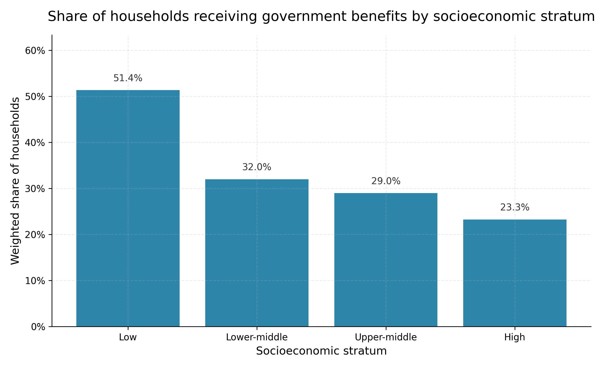
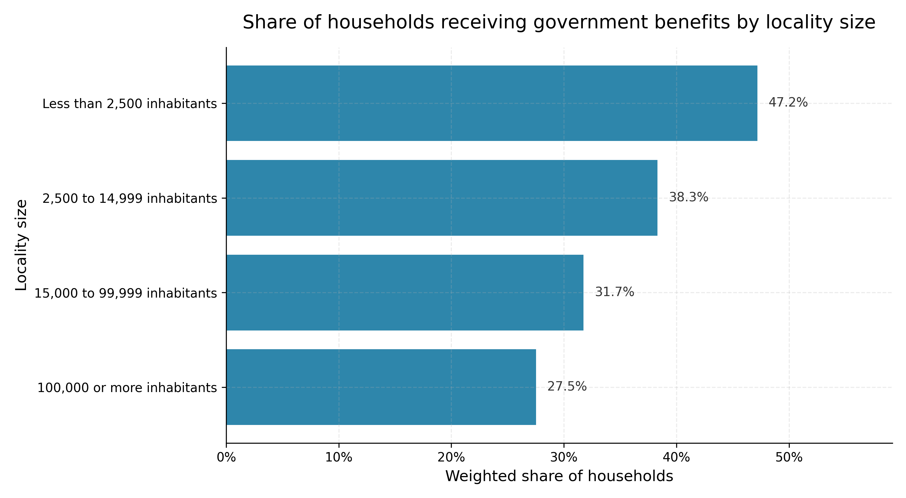
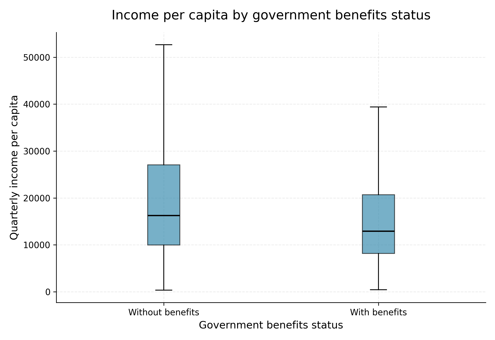
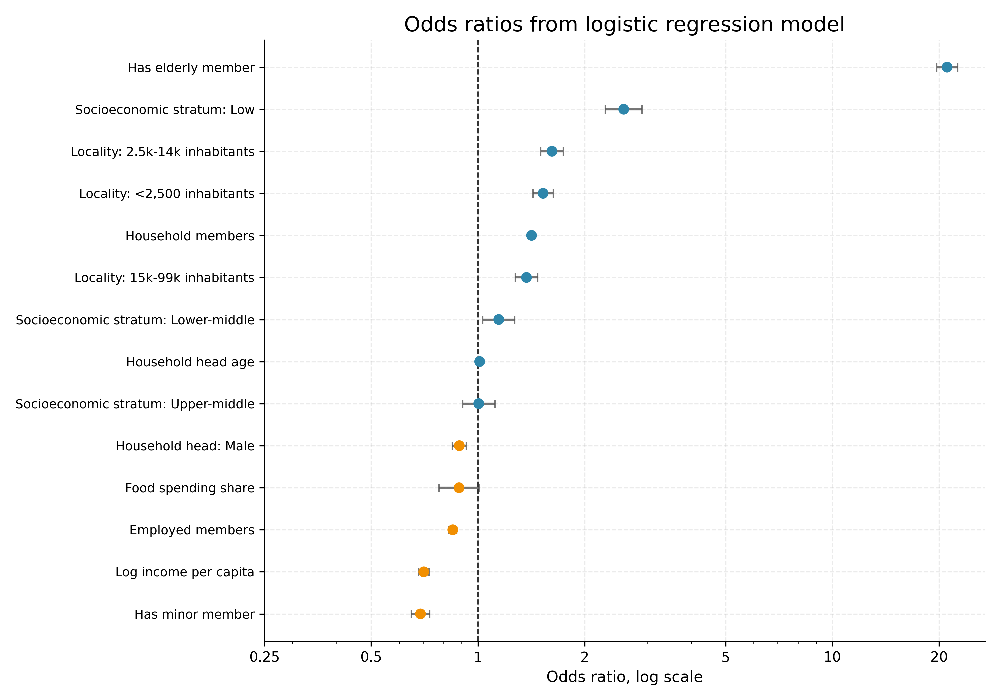
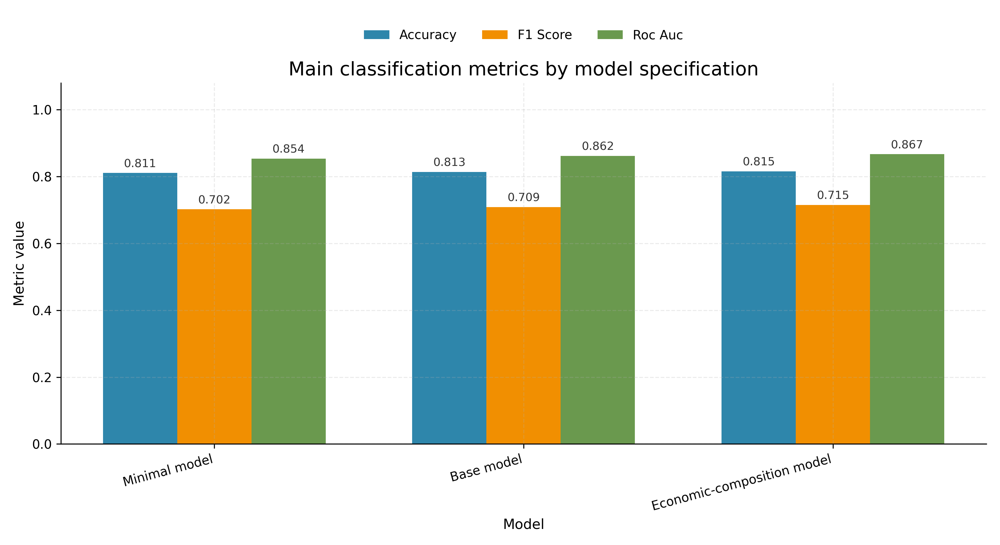
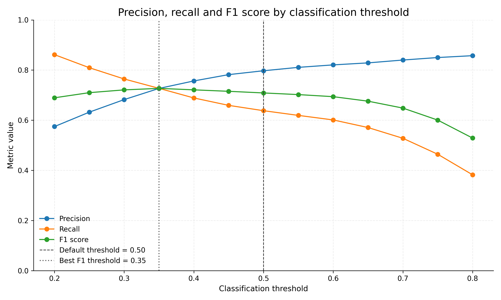
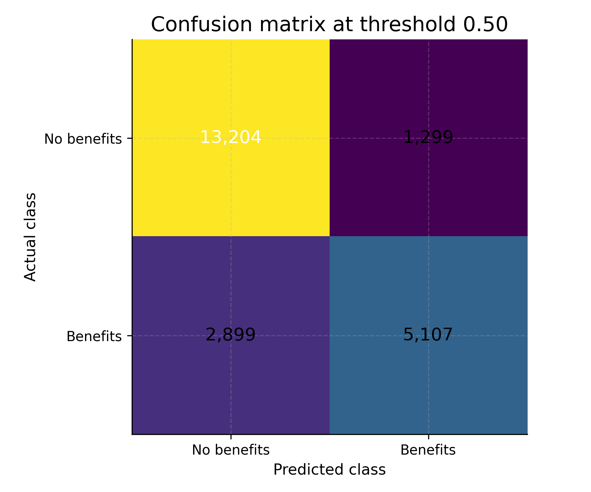

# Statistical Modeling of Government Benefit Receipt using ENIGH 2022

This project analyzes household receipt of government benefits in Mexico using public ENIGH 2022 microdata from INEGI.

The objective is to build a reproducible statistical modeling workflow to identify socioeconomic, demographic and territorial factors associated with whether a household reports income from government benefits.

## Research question

What household characteristics are associated with receiving government benefits in Mexico according to ENIGH 2022?

## Data source

The project uses public microdata from the **Encuesta Nacional de Ingresos y Gastos de los Hogares 2022 (ENIGH 2022)**, published by INEGI.

The main input file is:

- `concentradohogar.csv`

This file contains household-level information, including income components, household composition, socioeconomic stratum, locality size and survey design variables.

## Unit of analysis

The unit of analysis is the household.

Each row in the modeling dataset represents one household.

## Target variable

The target variable is:

- `received_government_benefits`

It was constructed from `government_benefits_income` as follows:

- `1` if `government_benefits_income > 0`
- `0` if `government_benefits_income = 0`

This variable identifies whether a household reports income from government benefits.

## Repository structure

```text
.
├── data/
│   ├── raw/
│   │   ├── concentradohogar.csv
│   │   └── README.md
│   └── processed/
│       └── modeling_dataset.csv
├── docs/
│   └── modeling_variables_dictionary.csv
├── outputs/
│   ├── figures/
│   │   ├── benefits_by_locality.png
│   │   ├── benefits_by_stratum.png
│   │   ├── income_boxplot_by_benefits.png
│   │   ├── income_distribution_by_benefits.png
│   │   ├── odds_ratios.png
│   │   ├── model_comparison_roc_auc.png
│   │   ├── model_comparison_main_metrics.png
│   │   ├── threshold_metrics.png
│   │   └── confusion_matrix_threshold_050.png
│   ├── tables/
│   │   ├── descriptive_statistics.csv
│   │   ├── government_benefits_by_locality.csv
│   │   ├── government_benefits_by_stratum.csv
│   │   ├── logistic_regression_odds_ratios.csv
│   │   ├── model_comparison.csv
│   │   ├── model_performance.csv
│   │   └── threshold_analysis.csv
│   ├── model_summary.txt
│   ├── model_comparison_summary.txt
│   ├── threshold_analysis_summary.txt
│   └── model_interpretation.md
├── scripts/
│   ├── 01_prepare_enigh_data.py
│   ├── 02_exploratory_analysis.py
│   ├── 03_logistic_regression_model.py
│   ├── 04_model_comparison.py
│   └── 05_threshold_analysis.py
├── requirements.txt
└── README.md
```

## Methodology

The project follows a reproducible data analysis workflow:

1. Prepare ENIGH 2022 household-level data.
2. Construct a binary target variable for government benefit receipt.
3. Generate exploratory tables and figures.
4. Estimate a logistic regression model.
5. Compare alternative model specifications.
6. Analyze classification thresholds and error trade-offs.

A binary logistic regression model is used because the outcome variable is binary: a household either reports receiving government benefits or does not.

## Exploratory analysis

### Government benefit receipt by socioeconomic stratum



The weighted share of households receiving government benefits is highest in the low socioeconomic stratum and decreases as socioeconomic stratum increases.

### Government benefit receipt by locality size



Households in smaller localities show higher benefit receipt. The highest weighted share appears in localities with fewer than 2,500 inhabitants.

### Income per capita by benefit status



Households receiving government benefits tend to have lower income per capita. However, the income distributions overlap, suggesting that income alone does not fully explain benefit receipt.

## Logistic regression model

The base model includes demographic, household composition, income, spending, territorial and socioeconomic predictors.

Key predictors include:

- income per capita;
- household size;
- presence of elderly members;
- presence of minor members;
- number of employed members;
- food spending share;
- locality size;
- socioeconomic stratum;
- sex and age of the household head.

### Odds ratios



The strongest predictor is whether the household has at least one elderly member. Households with elderly members show substantially higher odds of receiving government benefits, holding other variables constant.

Low socioeconomic stratum and smaller locality size are also associated with higher odds of receiving benefits. Higher income per capita is associated with lower odds of benefit receipt.

These results should be interpreted as statistical associations, not causal effects.

## Model comparison

Three logistic regression specifications were compared:

1. **Minimal model**  
   Uses five core conceptual predictors: income per capita, household size, elderly presence, locality size and socioeconomic stratum.

2. **Base model**  
   Adds additional demographic and household composition variables.

3. **Economic-composition model**  
   Adds labor income share to the base model.



The economic-composition model achieved the highest predictive performance. However, the improvement over the base model was small. The minimal model also performed well, suggesting that much of the predictive signal is captured by a compact set of household, socioeconomic and territorial variables.

The base model is retained as the main specification because it provides a strong balance between predictive performance, interpretability and methodological coherence.

## Threshold analysis

The base logistic regression model was evaluated under classification thresholds from 0.20 to 0.80.



The default threshold of 0.50 achieved the highest accuracy, but produced more false negatives than false positives. A lower threshold of 0.35 maximized the F1 score, increasing recall and reducing false negatives at the cost of more false positives.

This shows that threshold selection depends on the analytical or policy objective.

- A higher threshold is more conservative and reduces false positives.
- A lower threshold identifies more recipient households and reduces false negatives.

### Confusion matrix at threshold 0.50



At the 0.50 threshold, the model correctly classifies many households, but misses a meaningful number of actual benefit-recipient households. This illustrates the trade-off between exclusion errors and inclusion errors.

## Main results

The analysis suggests that government benefit receipt is associated with:

- presence of elderly members in the household;
- lower socioeconomic stratum;
- smaller locality size;
- lower income per capita;
- household composition and labor conditions.

The model comparison shows that interpretable logistic regression specifications can achieve strong predictive performance while still allowing clear interpretation of results.

## Limitations

This analysis has several limitations:

1. The model estimates associations, not causal effects.
2. The target variable is based on reported income from government benefits.
3. The analysis does not identify eligibility rules for specific government programs.
4. Logistic regression is estimated as an applied predictive model and does not fully implement complex survey design estimation.
5. Results depend on the selected variables and the construction of the target variable.

## How to reproduce the analysis

Install the required Python packages:

```bash
python3 -m pip install -r requirements.txt
```

Run the scripts in order:

```bash
python3 scripts/01_prepare_enigh_data.py
python3 scripts/02_exploratory_analysis.py
python3 scripts/03_logistic_regression_model.py
python3 scripts/04_model_comparison.py
python3 scripts/05_threshold_analysis.py
```

The outputs will be saved in:

```text
outputs/tables/
outputs/figures/
outputs/
```

## Project status

Completed first version.

Future improvements could include:

- cross-validation;
- additional socioeconomic predictors;
- state-level analysis;
- survey-design-aware modeling;
- comparison with other classification algorithms.